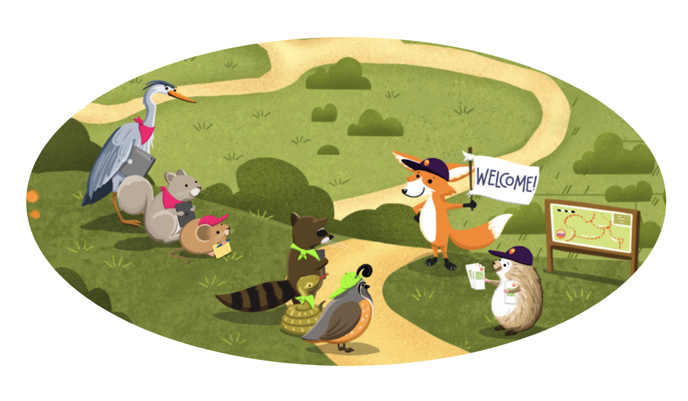

# GitHub practice from the browser

Working on GitHub.com, we contribute changes through **commits**. Let's create several commits by making small edits to this file, writing a commit message, and committing changes to see them posted nicely online to communicate our work. 

This file is written in Markdown, which formats text. For example, with Markdown:

We can make words **bold** or *italic*.

## We can make headers.

We can make lists – *note that lists need a carriage return before list items!*

1. bananas
2. tamales
3. cakes

[Markdown](https://quarto.org/docs/authoring/markdown-basics.html) can also make hyperlinks using the `` pattern: you put words to hyperlink in `[]` and the URL in `()`. For example:

> [This twitter thread](https://twitter.com/allison_horst/status/1287772985630191617) describes the palmerpenguins R package. 
Learn more on the [palmerpenguins webpage](https://allisonhorst.github.io/palmerpenguins).

*Note that we've also made a indented quote block with the `>` symbol*

We can include an image with the same `` pattern, but note the preceding exclamation point: ``. For example: 

*Note that this image lives in the folder one level above our `github-clinic` folder, and we indicate that with the two periods `..`* 

## Your turn

**Click the pencil to edit and make several commits as play around – what else can you change or add?**

**This is a bold scentence becuase why not**

1. This is interesting
2. This is helpful
3. This is useful

